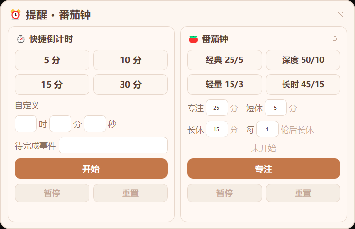

<table>
  <tr>
    <td valign="top">
      <h1>
        <br>
        蓝色小嗵
      </h1>
      <sub>XIAOTONG</sub>
      <br><br>
      <b>TA 从森林里来，因为想天天见到你。</b><br>
      <sub>A spirit from the forest, here to stay by your side.</sub>
      <br><br>
      
      
      
      <a href="https://github.com/gildingmazzonimo621-design/XIAOTONG-Desktop-pet/releases/latest">
        
      </a>
    </td>
    <td align="center" valign="middle">
      
    </td>
  </tr>
</table>

<table>
  <tr>
    <td align="center" width="25%">
      ✨<br>
      <b>TA 的眼睛会追着你</b><br>
      <sub>Eye Tracking</sub>
      <br><br>
      <sub>实时跟随你的鼠标光标，像是在注视着你</sub>
    </td>
    <td align="center" width="25%">
      🍃<br>
      <b>能和你说话、记住你</b><br>
      <sub>Talk & Remember</sub>
      <br><br>
      <sub>和 TA 聊天，TA 会记住你们之间发生过的事</sub>
    </td>
    <td align="center" width="25%">
      🌱<br>
      <b>越陪伴越亲密</b><br>
      <sub>Growth System</sub>
      <br><br>
      <sub>等级、任务、成就、商店，TA 在慢慢成长</sub>
    </td>
    <td align="center" width="25%">
      ☁️<br>
      <b>趴在窗口陪你工作</b><br>
      <sub>Window Snap</sub>
      <br><br>
      <sub>吸附到你正在用的窗口上方，跟着你走</sub>
    </td>
  </tr>
</table>

---

## 🌿 为什么做这只桌宠 · Why This Project

蓝色小嗵的形象来源于唱作组合 DOUDOU（杜冰儿、杜飞儿）的歌曲《嗵嗵》。
<br><sub>XIAOTONG is inspired by the song "Tong Tong" from singer-songwriter duo DOUDOU (Du Bing'er & Du Fei'er).</sub>

「嗵」是森林里果实落地的声响，也是生命轮转、生生不息的回响。这首歌讲的不是告别，而是每一次落下都意味着重新开始。
<br><sub>"Tong" is the sound of fruit falling in the forest — an echo of life's endless cycle. The song isn't about farewell; every fall marks a new beginning.</sub>

我很喜欢这个意象，所以把 TA 变成了一只住在桌面上的小精灵——TA 从森林里来，带着那声「嗵」，留在你身边。
<br><sub>I loved this imagery, so I turned it into a little spirit living on your desktop — TA came from the forest, carrying that sound of "tong", and stayed by your side.</sub>

---

## 🎮 开箱即玩 · 无需任何配置
<sub>Ready to Play · Zero Configuration</sub>

> 下载 EXE，双击就能启动——不需要安装，不需要配置环境，TA 直接出现在你的桌面上，从这一刻起，TA「出生第 1 天」。
>
> <sub>Download the EXE, double-click to launch — no installation, no setup. TA appears on your desktop right away, and from this moment on, it's TA's "Day 1".</sub>

### 丰富的互动动画
<sub>Rich Interactive Animations</sub>

在个人中心点击互动按钮，TA 会做出对应的动画反应，冒出不同的对话气泡。每种互动都会影响 TA 的属性——喂食回复饱食度，摸头提升心情和亲密度，睡觉恢复体力。
<br><sub>Click interaction buttons in the Profile Center and TA responds with matching animations and dialogue bubbles. Each interaction affects TA's stats — feeding restores hunger, petting boosts mood and affection, sleeping recovers energy.</sub>

<table>
  <tr>
    <td align="center"><br/><b>摸摸头</b><br/><sub>Head Pat</sub></td>
    <td align="center"><br/><b>吃东西</b><br/><sub>Feeding</sub></td>
    <td align="center"><br/><b>打羽毛球</b><br/><sub>Badminton</sub></td>
  </tr>
  <tr>
    <td align="center"><br/><b>看书学习</b><br/><sub>Studying</sub></td>
    <td align="center"><br/><b>唤醒</b><br/><sub>Waking up</sub></td>
    <td align="center"><br/><b>变猫猫</b><br/><sub>Cat Form</sub></td>
  </tr>
</table>

- **12 套基础动画**：行走、摸头、吃东西、睡觉、唤醒、玩耍、变猫猫、看书学习、拖拽、吸附等，每套都有独特的台词和表情反应
  <br><sub>12 base animations: walk, pet, eat, sleep, wake, play, cat form, study, drag, snap, etc. — each with unique dialogue and expressions</sub>
- **7 套道具动画**：在商店购买道具后使用，会播放专属的道具动画（苹果、蛋糕、糖果、咖啡、玩偶、经验星、礼物盒）
  <br><sub>7 item animations: purchase items from the shop and use them for exclusive animations (apple, cake, candy, coffee, doll, XP star, gift box)</sub>
- **情绪对话气泡**：气泡配色随心情自动变化——开心淡黄、难过淡蓝、饥饿淡橙、困倦淡紫；气泡紧贴桌宠显示，桌宠靠近屏幕顶部时自动切到下方
  <br><sub>Mood-colored bubbles: colors shift with emotion — happy pale-yellow, sad pale-blue, hungry pale-orange, sleepy pale-purple; bubbles auto-flip when near the top of the screen</sub>

### 感知你的一举一动
<sub>Senses Your Every Move</sub>

你不需要打开任何面板，TA 就能感知到你在做什么，并做出实时反应。
<br><sub>No panel needed — TA senses what you're doing and reacts in real time.</sub>

<table>
  <tr>
    <td align="center"><br/><b>👁️ 眼睛跟随鼠标</b><br/><sub>Eye Tracking</sub></td>
    <td align="center"><br/><b>⌨️ 感知键盘节奏</b><br/><sub>Keyboard Awareness</sub></td>
    <td align="center"><br/><b>🔍 透明度自由调节</b><br/><sub>Opacity Control</sub></td>
  </tr>
</table>

- **眼睛跟随**：idle 状态下桌宠的眼睛会实时追踪鼠标光标，不是简单的方向切换，而是平滑的连续跟踪，眼睛里的高光也会随桌宠尺寸等比缩放
  <br><sub>Eye tracking: in idle state, TA's eyes smoothly follow your cursor — not simple directional flips, but continuous tracking with proportionally scaled highlights</sub>
- **键盘感知**：打字时桌宠会轻微抖动欢呼，像是在给你加油；打字速度特别快时，TA 还有专属的高速输入反应
  <br><sub>Keyboard awareness: TA cheers with a gentle bounce while you type, as if rooting for you; extra-fast typing triggers a special reaction</sub>
- **透明度调节**：20%–100% 滑块自由调节，工作时调低不遮挡视线，想看 TA 时调高
  <br><sub>Opacity slider: freely adjust from 20% to 100% — lower it while working, raise it when you want to see TA</sub>

### 🐾 趴在窗口上陪你工作
<sub>Sits on Your Window While You Work</sub>

工作的时候不想让 TA 孤零零待在桌面底部？TA 可以趴在你正在用的窗口上方，陪着你一起干活。
<br><sub>Don't want TA sitting alone at the bottom of the desktop while you work? TA can perch on top of your active window and keep you company.</sub>

<p align="center">
  
</p>

- **自动吸附**：TA 会自动检测当前活动窗口，吸附到窗口标题栏上方，切换为专属的趴趴姿态
  <br><sub>Auto-snap: TA detects the active window and snaps to the title bar, switching to a perching pose</sub>
- **跟随移动**：窗口移到哪，TA 就跟到哪。拖动窗口、切换窗口，TA 都会跟上
  <br><sub>Follow movement: wherever the window goes, TA follows — drag, switch, TA keeps up</sub>
- **全窗口支持**：浏览器、编辑器、文件夹、聊天窗口——所有窗口都能趴
  <br><sub>Universal support: browser, editor, file explorer, chat — TA can perch on any window</sub>
- **物理抛掷**：想让 TA 下来？直接拖拽甩出去，有重力下落和边界回弹效果
  <br><sub>Physics toss: want TA down? Drag and fling — complete with gravity and bounce effects</sub>

---

## 🧠 连接 API · 解锁你的专属伙伴
<sub>Connect API · Unlock Your Personal Companion</sub>

> 填入 API 地址和 Key（兼容 OpenAI 格式的接口），TA 就不只是会动的桌宠了——TA 能和你说话，能记住你们之间发生过的事，能变成真正属于你的伙伴。
>
> <sub>Enter an API endpoint and key (compatible with OpenAI-format APIs) and TA becomes more than an animated pet — TA can talk to you, remember what happened between you, and become a companion that truly belongs to you.</sub>

### 💬 聊天对话
<sub>Chat</sub>

在个人中心的「聊天」页里和 TA 说话，TA 的回复会同时以气泡形式弹出在桌宠旁边。聊天过程中 TA 还会自动从对话里提取关键信息，转化为长期记忆。
<br><sub>Talk to TA in the "Chat" tab of the Profile Center. TA's replies also pop up as bubbles beside the pet. During conversation, TA automatically extracts key information and turns it into long-term memory.</sub>

<p align="center">
  
</p>

- **面板对话**：右键桌宠 → 个人中心 → 聊天，在这里输入文字和 TA 交流，所有对话记录完整保留，随时可翻看
  <br><sub>Panel chat: right-click pet → Profile Center → Chat. Type to talk; full history is preserved and scrollable</sub>
- **桌面气泡**：TA 的回复会以圆角气泡弹出在桌宠旁边，不用一直盯着面板也能看到 TA 在说什么
  <br><sub>Desktop bubbles: TA's replies pop up as rounded bubbles next to the pet — no need to keep the panel open</sub>
- **动画联动**：聊天内容会自动触发匹配动画——聊到吃的会播放吃东西动画，说到困了会播放睡觉动画
  <br><sub>Animation sync: chat content auto-triggers matching animations — mention food and TA eats, mention tiredness and TA sleeps</sub>
- **时段台词**：即使不主动聊天，TA 也会根据当前时段（早晨/中午/傍晚/深夜）和自身心情，随机冒出不同的气泡台词
  <br><sub>Time-based lines: even without chatting, TA randomly says different things based on the time of day and mood</sub>

### 📚 知识中心
<sub>Knowledge Hub</sub>

对话里 TA 自动提取的记忆、你手动添加的信息、从网页抓取的内容，都统一汇总在独立的知识中心窗口里。在这里你可以查看、整理、搜索 TA 知道的一切。
<br><sub>Memories extracted from conversations, manually added info, and web-scraped content are all gathered in a dedicated Knowledge Hub window. Browse, organize, and search everything TA knows.</sub>

<p align="center">
  
</p>

- **分类管理**：记忆按来源自动归类为对话提取、文档导入、网络爬取、手动添加四种类型
  <br><sub>Categorized: memories are auto-sorted by source — conversation extraction, document import, web scraping, manual entry</sub>
- **角色设定**：内置角色设定文档，永久生效，可以直接在界面里编辑，也可以导入外部 `.txt` 文件来定义 TA 的性格和背景
  <br><sub>Persona setup: built-in persona document, always active; edit in-app or import a .txt file to define TA's personality and background</sub>
- **网页搜集**：输入网址一键抓取网页正文，支持百度百科、B 站视频简介、通用网页，抓取后自动存入知识库
  <br><sub>Web scraping: paste a URL to grab page content — supports Baidu Baike, Bilibili video descriptions, and general web pages</sub>
- **搜索与筛选**：关键字搜索 + 来源分类筛选，快速定位任意一条记忆
  <br><sub>Search & filter: keyword search plus source-type filtering to quickly locate any memory</sub>
- **手动添加**：随时手动输入想让 TA 记住的内容
  <br><sub>Manual entry: type anything you want TA to remember at any time</sub>

<details>
<summary>📋 <b>首次配置 API</b> · <sub>First-Time API Setup</sub></summary>
<br/>
<p align="center">
  
</p>

右键桌宠 → **个人中心** → **设置**，填写 API 地址、Key 和模型名称，点击「测试连接」即可。兼容 OpenAI 格式的接口（DeepSeek、ChatGPT、Claude 等均可）。
<br><sub>Right-click pet → Profile Center → Settings. Enter the API endpoint, key, and model name, then click "Test Connection". Compatible with any OpenAI-format API (DeepSeek, ChatGPT, Claude, etc.).</sub>

</details>

---

## ⏱️ 实用效率工具 · 陪伴你的专注与小憩
<sub>Practical Tools · For Focus and Rest</sub>

> TA 不仅仅是个有趣的玩具，更是你桌面上的效率小助手。
> 
> <sub>TA is not just a fun toy, but also a productivity assistant on your desktop.</sub>

<p align="center">
  
</p>

- **🍅 沉浸式番茄钟**：内置经典的番茄工作法（支持 25/5、50/10 等预设模式及自定义）。专注时 TA 会安静陪伴，不打扰你的思路；休息时间一到，TA 会准时提醒你放松。
  <br><sub>Pomodoro Timer: Built-in Pomodoro method with presets and custom durations. TA stays quiet while you focus, and reminds you to take a break.</sub>
- **⏱️ 贴心快捷倒计时**：泡面、敷面膜还是午间小憩？只需轻轻一点，快捷设置倒计时。时间一到，TA 会第一时间在屏幕上呼唤你。
  <br><sub>Quick Countdown: Cooking instant noodles, using a face mask, or taking a quick nap? Set a countdown with one click. TA will pop up to notify you exactly when time is up.</sub>

## 🎯 养成系统 · 越陪伴越亲密
<sub>Growth System · The More You Care, the Closer You Get</sub>

TA 不只是一个动画挂件。TA 有饥饿感、有情绪、会疲倦，你的每一次互动都会被记录下来，转化成经验、等级和成就。
<br><sub>TA is more than an animated widget. TA gets hungry, has emotions, and grows tired. Every interaction is tracked and converted into XP, levels, and achievements.</sub>

<table>
  <tr>
    <td align="center" width="50%">
      <br/>
      <b>📊 属性与互动</b><br/><sub>Stats & Interactions</sub>
    </td>
    <td align="center" width="50%">
      <br/>
      <b>🏆 成就系统</b><br/><sub>Achievements</sub>
    </td>
  </tr>
</table>

- **四大属性**：饱食度、心情值、体力值、亲密度，随时间自然衰减，需要你的陪伴来维持
  <br><sub>Four core stats: hunger, mood, energy, affection — they decay over time and need your care to maintain</sub>
- **等级成长**：陪伴自动积累经验值，升级解锁更多内容
  <br><sub>Level growth: companionship earns XP automatically; level up to unlock more content</sub>
- **每日签到**：连续签到有额外加成奖励
  <br><sub>Daily check-in: consecutive check-ins earn bonus rewards</sub>
- **每日任务**：每天 8 个任务（1 个固定登录任务 + 从 21 个任务池按日期轮换的 7 个），涵盖喂食、摸头、玩耍、学习、聊天等
  <br><sub>Daily quests: 8 tasks per day (1 fixed login task + 7 rotating from a pool of 21), covering feeding, petting, playing, studying, chatting, etc.</sub>
- **12 项成就**：从「第一口饭」到「心意相通」，解锁获得金币奖励
  <br><sub>12 achievements: from "First Bite" to "Soulmates" — unlock them for coin rewards</sub>
- **金币商店**：7 种道具，各有专属动画和属性效果；购买后存入背包，随时可用
  <br><sub>Coin shop: 7 items, each with exclusive animations and stat effects; purchased items go to your inventory for use anytime</sub>

---

## 📥 下载使用
<sub>Download</sub>

前往本仓库的 [Releases](https://github.com/gildingmazzonimo621-design/XIAOTONG-Desktop-pet/releases) 页面，下载最新版本的 EXE 文件，解压后双击运行即可。
<br><sub>Go to the [Releases](https://github.com/gildingmazzonimo621-design/XIAOTONG-Desktop-pet/releases) page of this repo, download the latest EXE, and double-click to run.</sub>

- 无需安装 Python 或任何依赖
  <br><sub>No need to install Python or any dependencies</sub>
- 用户数据自动存放在 EXE 同级的 `geren/` 目录下，解压到哪里数据就跟到哪里，不占用 C 盘空间
  <br><sub>User data is stored in the `geren/` folder next to the EXE — portable, no C: drive clutter</sub>
- 同一时间只允许运行一个实例，重复启动会弹出提示
  <br><sub>Only one instance allowed at a time; duplicate launches show a warning</sub>

<details>
<summary>🔧 <b>从源码运行（开发者）</b> · <sub>Run from Source (Developers)</sub></summary>

**环境要求 · Requirements**：Windows 10 / 11 + Python 3.10+

```bash
pip install PyQt5 pynput
python main.py
```

**打包为 EXE · Build EXE**：

```bash
pip install pyinstaller
python -m PyInstaller tools/build_onefile.spec --noconfirm
```

打包后 `dist/xiaotong.exe` 即为完整程序。
<br><sub>After building, `dist/xiaotong.exe` is the complete program.</sub>

</details>

---

<details>
<summary><b>📂 项目结构</b> · <sub>Project Structure</sub></summary>

```
main.py                           # Entry: pet window, physics engine, tray menu
src/
├── pet_state.py                  # Pet state & stats management
├── pet_animator.py               # Animation state machine & frame timing
├── pet_renderer_sprite.py        # Sprite rendering & frame sequence loading
├── bubble_widget.py              # Desktop bubble popup (mood colors + DPI-aware)
├── input_monitor.py              # Global keyboard/mouse event listener
├── chat_service.py               # API calls & memory extraction
├── game_systems.py               # Check-in, quests, achievements, shop, inventory
├── status_panel.py               # Profile Center panel (7 tabs + memory manager)
├── knowledge_hub.py              # Knowledge Hub window (folders + search + scraping)
├── snap_system.py                # Window snap detection (DPI-aware coordinates)
├── web_crawler.py                # Web content scraping (stdlib only)
├── pak_loader.py                 # Animation resource pack loader
└── user_data.py                  # Data path management & legacy migration
tools/
├── build_onefile.spec            # Single-file build config
├── build.spec                    # Directory build config
└── dpi_aware.manifest            # Per-Monitor DPI awareness manifest
```

</details>

<details>
<summary><b>💾 数据存储</b> · <sub>Data Storage</sub></summary>

所有个人数据存放在程序目录下的 `geren/` 文件夹，不占用 C 盘空间。首次启动自动从旧版本路径迁移数据。
<br><sub>All personal data is stored in the `geren/` folder under the program directory — no C: drive usage. First launch auto-migrates data from legacy paths.</sub>

```
geren/
├── chat_config.json          # API configuration
├── chat_memory.json          # Chat history & memories
├── pet_save.json             # Pet save data
├── game_data.json            # Check-in, quests, achievements, inventory
├── default_persona.txt       # Persona document (editable)
└── avatar_custom.png         # Custom avatar
```

</details>

---

## 📬 联系我 · Contact

如果你有任何想法、建议，或希望进行商业合作，欢迎通过微信联系我：
<br><sub>If you have ideas, suggestions, or want to discuss commercial collaboration, feel free to reach me on WeChat:</sub>

**微信 / WeChat**：`xy12981118`（添加时请备注来意 / Please include a note about your purpose when adding）

---

## 📜 开源协议 · License

本项目基于 [Apache License 2.0](LICENSE) 开源，并附加 [额外条款](ADDITIONAL_TERMS.md)。使用本项目即表示你同意同时遵守两份文件。
<br><sub>This project is released under [Apache License 2.0](LICENSE) with [Additional Terms](ADDITIONAL_TERMS.md). By using this project you agree to comply with both.</sub>

- ✅ 自由使用、修改和分发，但需**署名并链接回原仓库**
  <br><sub>Free to use, modify, and distribute — with attribution and link-back required</sub>
- ❌ 未经授权**不得售卖或用于任何付费产品/服务**
  <br><sub>No selling or paid offerings without prior written consent</sub>
- 🔒 **「关于」区域不可修改或移除**
  <br><sub>The "About" section must not be modified or removed</sub>
- 🤝 **欢迎商业合作洽谈**，请先通过上方微信联系作者
  <br><sub>Commercial collaboration is welcome — please contact the author via WeChat above</sub>
- 📄 分发时必须同时附带 `LICENSE` 和 `ADDITIONAL_TERMS.md`
  <br><sub>Distribution must include both `LICENSE` and `ADDITIONAL_TERMS.md`</sub>

---

## 🛠️ 技术栈
<sub>Tech Stack</sub>

| 技术 | 用途 | Purpose |
|------|------|---------|
| **Python 3.10+** | 主语言 | Primary language |
| **PyQt5** | 界面渲染，高 DPI 自适应 | UI rendering, high-DPI adaptive |
| **pynput** | 全局键盘 / 鼠标监听 | Global keyboard/mouse listener |
| **Win32 API (ctypes)** | 窗口枚举、DPI 感知、单实例互斥锁 | Window enumeration, DPI awareness, single-instance mutex |
| **urllib / ssl** | HTTP 请求，零第三方网络依赖 | HTTP requests, zero third-party network deps |
| **PyInstaller** | 打包为 EXE，内嵌 DPI 清单 | Bundle as EXE with embedded DPI manifest |
