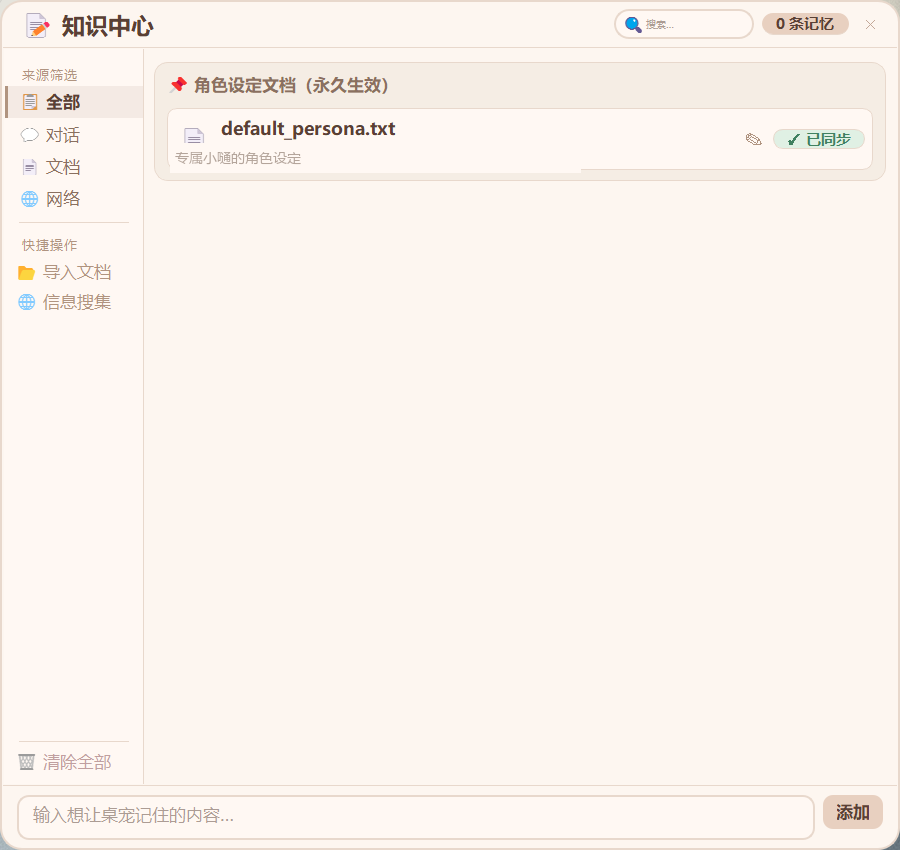

<table>
  <tr>
    <td valign="top">
      <h1>
        <br>
        蓝色小嗵
      </h1>
      <sub>XIAOTONG</sub>
      <br><br>
      <b>TA 从森林里来，因为想天天见到你。</b><br>
      <sub>A spirit from the forest, here to stay by your side.</sub>
      <br><br>
      
      
      
      <a href="https://github.com/gildingmazzonimo621-design/XIAOTONG-Desktop-pet/releases/latest">
        
      </a>
    </td>
    <td align="center" valign="middle">
      
    </td>
  </tr>
</table>

<table>
  <tr>
    <td align="center" width="25%">
      ✨<br>
      <b>TA 的眼睛会追着你</b><br>
      <sub>Eye Tracking</sub>
      <br><br>
      <sub>实时跟随你的鼠标光标，像是在注视着你</sub>
    </td>
    <td align="center" width="25%">
      🍃<br>
      <b>能和你说话、记住你</b><br>
      <sub>Talk & Remember</sub>
      <br><br>
      <sub>和 TA 聊天，TA 会记住你们之间发生过的事</sub>
    </td>
    <td align="center" width="25%">
      🌱<br>
      <b>越陪伴越亲密</b><br>
      <sub>Growth System</sub>
      <br><br>
      <sub>等级、任务、成就、商店，TA 在慢慢成长</sub>
    </td>
    <td align="center" width="25%">
      ☁️<br>
      <b>趴在窗口陪你工作</b><br>
      <sub>Window Snap</sub>
      <br><br>
      <sub>吸附到你正在用的窗口上方，跟着你走</sub>
    </td>
  </tr>
</table>

---

## 🎮 开箱即玩 · 无需任何配置

> 下载 EXE，双击就能启动——不需要安装，不需要配置环境，TA 直接出现在你的桌面上，从这一刻起，TA「出生第 1 天」。

### 丰富的互动动画

在个人中心点击互动按钮，TA 会做出对应的动画反应，冒出不同的对话气泡。每种互动都会影响 TA 的属性——喂食回复饱食度，摸头提升心情和亲密度，睡觉恢复体力。

<table>
  <tr>
    <td align="center"><br/><b>摸摸头</b></td>
    <td align="center"><br/><b>吃东西</b></td>
    <td align="center"><br/><b>打羽毛球</b></td>
  </tr>
  <tr>
    <td align="center"><br/><b>看书学习</b></td>
    <td align="center"><br/><b>睡觉</b></td>
    <td align="center"><br/><b>变猫猫</b></td>
  </tr>
</table>

- **12 套基础动画**：行走、摸头、吃东西、睡觉、唤醒、玩耍、变猫猫、看书学习、拖拽、吸附等，每套都有独特的台词和表情反应
- **7 套道具动画**：在商店购买道具后使用，会播放专属的道具动画（苹果、蛋糕、糖果、咖啡、玩偶、经验星、礼物盒）
- **情绪对话气泡**：气泡配色随心情自动变化——开心淡黄、难过淡蓝、饥饿淡橙、困倦淡紫；气泡紧贴桌宠显示，桌宠靠近屏幕顶部时自动切到下方

### 感知你的一举一动

你不需要打开任何面板，TA 就能感知到你在做什么，并做出实时反应。

<table>
  <tr>
    <td align="center"><br/><b>👁️ 眼睛跟随鼠标</b></td>
    <td align="center"><br/><b>⌨️ 感知键盘节奏</b></td>
    <td align="center"><br/><b>🔍 透明度自由调节</b></td>
  </tr>
</table>

- **眼睛跟随**：idle 状态下桌宠的眼睛会实时追踪鼠标光标，不是简单的方向切换，而是平滑的连续跟踪，眼睛里的高光也会随桌宠尺寸等比缩放
- **键盘感知**：打字时桌宠会轻微抖动欢呼，像是在给你加油；打字速度特别快时，TA 还有专属的高速输入反应
- **透明度调节**：20%–100% 滑块自由调节，工作时调低不遮挡视线，想看 TA 时调高

### 🐾 趴在窗口上陪你工作

工作的时候不想让 TA 孤零零待在桌面底部？TA 可以趴在你正在用的窗口上方，陪着你一起干活。

<p align="center">
  
</p>

- **自动吸附**：TA 会自动检测当前活动窗口，吸附到窗口标题栏上方，切换为专属的趴趴姿态
- **跟随移动**：窗口移到哪，TA 就跟到哪。拖动窗口、切换窗口，TA 都会跟上
- **全窗口支持**：浏览器、编辑器、文件夹、聊天窗口——所有窗口都能趴
- **物理抛掷**：想让 TA 下来？直接拖拽甩出去，有重力下落和边界回弹效果

---

## 🧠 连接 API · 解锁你的专属伙伴

> 填入 API 地址和 Key（兼容 OpenAI 格式的接口），TA 就不只是会动的桌宠了——TA 能和你说话，能记住你们之间发生过的事，能变成真正属于你的伙伴。

### 💬 聊天对话

在个人中心的「聊天」页里和 TA 说话，TA 的回复会同时以气泡形式弹出在桌宠旁边。聊天过程中 TA 还会自动从对话里提取关键信息，转化为长期记忆。

<p align="center">
  
</p>

- **面板对话**：右键桌宠 → 个人中心 → 聊天，在这里输入文字和 TA 交流，所有对话记录完整保留，随时可翻看
- **桌面气泡**：TA 的回复会以圆角气泡弹出在桌宠旁边，不用一直盯着面板也能看到 TA 在说什么
- **动画联动**：聊天内容会自动触发匹配动画——聊到吃的会播放吃东西动画，说到困了会播放睡觉动画
- **时段台词**：即使不主动聊天，TA 也会根据当前时段（早晨/中午/傍晚/深夜）和自身心情，随机冒出不同的气泡台词

### 📚 知识中心

对话里 TA 自动提取的记忆、你手动添加的信息、从网页抓取的内容，都统一汇总在独立的知识中心窗口里。在这里你可以查看、整理、搜索 TA 知道的一切。

<p align="center">
  
</p>

- **分类管理**：记忆按来源自动归类为对话提取、文档导入、网络爬取、手动添加四种类型
- **角色设定**：内置角色设定文档，永久生效，可以直接在界面里编辑，也可以导入外部 `.txt` 文件来定义 TA 的性格和背景
- **网页搜集**：输入网址一键抓取网页正文，支持百度百科、B 站视频简介、通用网页，抓取后自动存入知识库
- **搜索与筛选**：关键字搜索 + 来源分类筛选，快速定位任意一条记忆
- **手动添加**：随时手动输入想让 TA 记住的内容

<details>
<summary>📋 <b>首次配置 API</b></summary>
<br/>
<p align="center">
  
</p>

右键桌宠 → **个人中心** → **设置**，填写 API 地址、Key 和模型名称，点击「测试连接」即可。兼容 OpenAI 格式的接口（DeepSeek、ChatGPT、Claude 等均可）。

</details>

---

## 🎯 养成系统 · 越陪伴越亲密

TA 不只是一个动画挂件。TA 有饥饿感、有情绪、会疲倦，你的每一次互动都会被记录下来，转化成经验、等级和成就。

<table>
  <tr>
    <td align="center" width="50%">
      <br/>
      <b>📊 属性与互动</b>
    </td>
    <td align="center" width="50%">
      <br/>
      <b>🏆 成就系统</b>
    </td>
  </tr>
</table>

- **四大属性**：饱食度、心情值、体力值、亲密度，随时间自然衰减，需要你的陪伴来维持
- **等级成长**：陪伴自动积累经验值，升级解锁更多内容
- **每日签到**：连续签到有额外加成奖励
- **每日任务**：每天 8 个任务（1 个固定登录任务 + 从 21 个任务池按日期轮换的 7 个），涵盖喂食、摸头、玩耍、学习、聊天等
- **12 项成就**：从「第一口饭」到「心意相通」，解锁获得金币奖励
- **金币商店**：7 种道具，各有专属动画和属性效果；购买后存入背包，随时可用

---

## 📥 下载使用

前往本仓库的 [Releases](https://github.com/gildingmazzonimo621-design/XIAOTONG-Desktop-pet/releases) 页面，下载最新版本的 EXE 文件，解压后双击运行即可。

- 无需安装 Python 或任何依赖
- 用户数据自动存放在 EXE 同级的 `geren/` 目录下，解压到哪里数据就跟到哪里，不占用 C 盘空间
- 同一时间只允许运行一个实例，重复启动会弹出提示

<details>
<summary>🔧 <b>从源码运行（开发者）</b></summary>

**环境要求**：Windows 10 / 11 + Python 3.10+

```bash
pip install PyQt5 pynput
python main.py
```

**打包为 EXE**：

```bash
pip install pyinstaller
python -m PyInstaller tools/build_onefile.spec --noconfirm
```

打包后 `dist/xiaotong.exe` 即为完整程序。

</details>

---

<details>
<summary><b>📂 项目结构</b></summary>

```
main.py                           # 入口：桌宠窗口、物理引擎、托盘菜单
src/
├── pet_state.py                  # 宠物状态与属性管理
├── pet_animator.py               # 动画状态机与帧计时
├── pet_renderer_sprite.py        # 精灵渲染与帧序列加载
├── bubble_widget.py              # 桌面气泡弹窗（情绪配色 + DPI 自适应）
├── input_monitor.py              # 全局键盘/鼠标事件监听
├── chat_service.py               # 接口调用与记忆提取
├── game_systems.py               # 签到、任务、成就、商店、背包
├── status_panel.py               # 个人中心面板（7 个标签页 + 记忆管理窗口）
├── knowledge_hub.py              # 知识中心窗口（文件夹 + 搜索 + 爬取）
├── snap_system.py                # 窗口吸附检测（DPI 感知坐标转换）
├── web_crawler.py                # 网页内容抓取（纯标准库）
├── pak_loader.py                 # 动画资源包加载
└── user_data.py                  # 数据路径管理与旧版迁移
tools/
├── build_onefile.spec            # 单文件打包配置
├── build.spec                    # 目录打包配置
└── dpi_aware.manifest            # Per-Monitor DPI 感知清单
```

</details>

<details>
<summary><b>💾 数据存储</b></summary>

所有个人数据存放在程序目录下的 `geren/` 文件夹，不占用 C 盘空间。首次启动自动从旧版本路径迁移数据。

```
geren/
├── chat_config.json          # API 配置
├── chat_memory.json          # 聊天记录与记忆
├── pet_save.json             # 宠物存档
├── game_data.json            # 签到、任务、成就、背包
├── default_persona.txt       # 角色设定文档（可编辑）
└── avatar_custom.png         # 自定义头像
```

</details>

---

## 🛠️ 技术栈

| 技术 | 用途 |
|------|------|
| **Python 3.10+** | 主语言 |
| **PyQt5** | 界面渲染，高 DPI 自适应 |
| **pynput** | 全局键盘 / 鼠标监听 |
| **Win32 API (ctypes)** | 窗口枚举、DPI 感知、单实例互斥锁 |
| **urllib / ssl** | HTTP 请求，零第三方网络依赖 |
| **PyInstaller** | 打包为 EXE，内嵌 DPI 清单 |

---

## 🌿 为什么做这只桌宠 · Why This Project

蓝色小嗵的形象来源于唱作组合 DOUDOU（杜冰儿、杜飞儿）的歌曲《嗵嗵》。

「嗵」是森林里果实落地的声响，也是生命轮转、生生不息的回响。这首歌讲的不是告别，而是每一次落下都意味着重新开始。

我很喜欢这个意象，所以把 TA 变成了一只住在桌面上的小精灵——TA 从森林里来，带着那声「嗵」，留在你身边。

